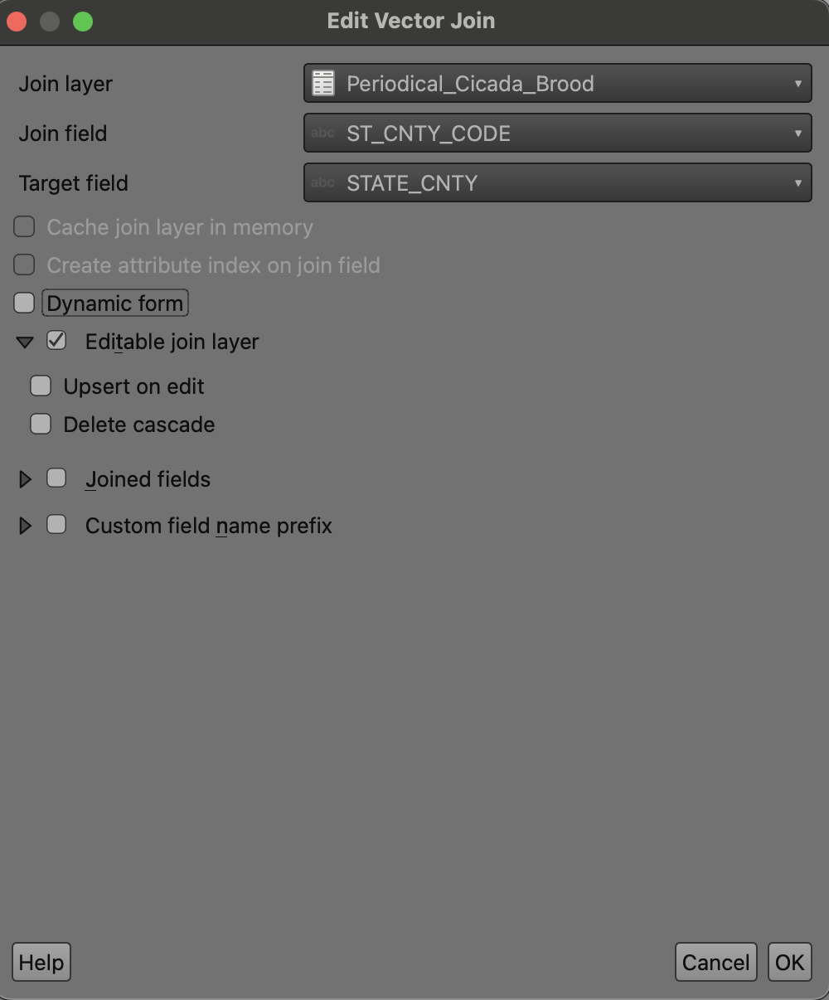
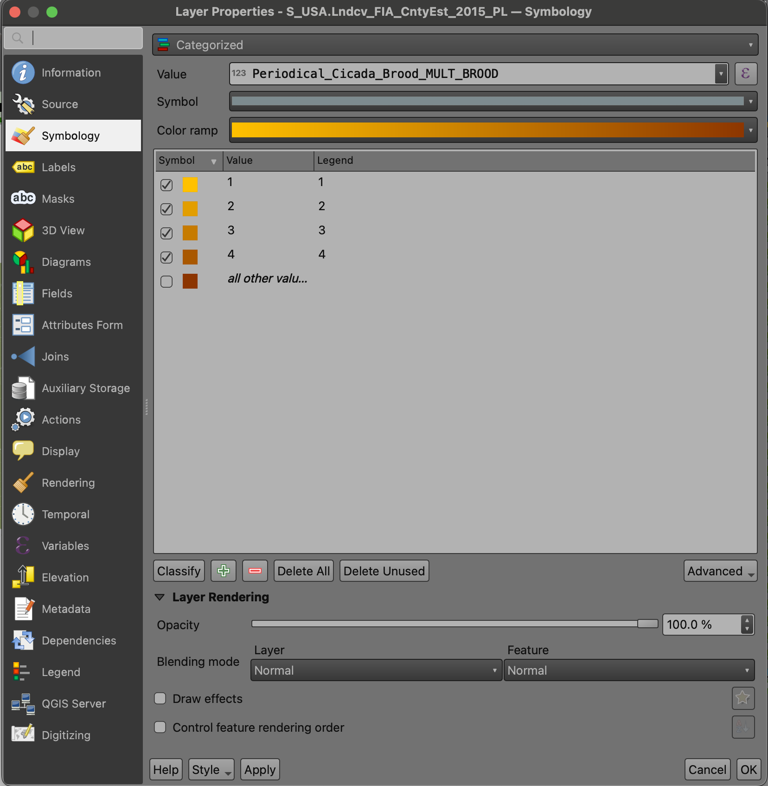
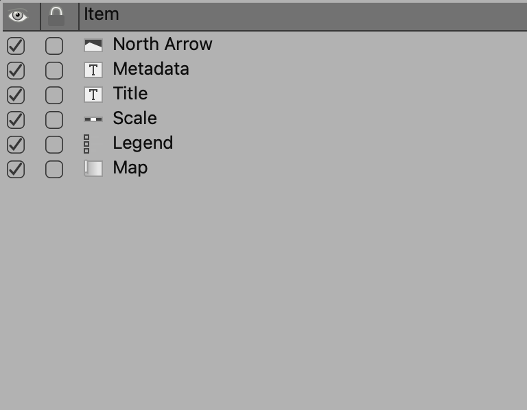

# Periodical Cicada Distribution

## Project Contents

- [Data Sources](#data-sources)
- [Project Background](#project-background)
- [Map summary](#map-summary)

***

### Data Sources

[Link to county boundaries data source "FIA Landcover County Estimates 2015"](https://data.fs.usda.gov/geodata/edw/datasets.php?dsetCategory=boundaries)

According to the U.S. Forest Service (2018), the areas in this dataset "...were calculated within county limits using the US Census Bureau's county spatial data". This was later used to depict landcover estimates, though these are not depicted in this (Periodical Cicada Distribution) map.

[Link to cicada broods data source "Periodical Cicada Broods (Feature Layer)"](https://data-usfs.hub.arcgis.com/datasets/periodical-cicada-broods-feature-layer/about)

According to the U.S. Forest Service (2021), this dataset depicts "...periodical cicada distribution and expected year of emergence by cicada brood and county. The periodical cicada emerges in massive groups once every 13 or 17 years and is completely unique to North America. There are 15 of these mass groups, called broods, of periodical cicadas in the United States. This county-based data, complied by the USFS Northern Research Station, depict where and when the different broods of periodical cicadas are likely to emerge in the US through 2037. The data was compiled for the 2011 publication entitled "Avian predators are less abundant during periodical cicada emergences, but why?" (Koenig et al. https://dx.doi.org/10.1890/10-1583.1) using data from periodical cicada publications listed below. 1. Marlatt, C. L. 1907. "The periodical cicada". Bulletin of the USDA Bureau of Entomology 71:1?181. 2. Simon, C. 1988. "Evolution of 13- and 17-year periodical cicadas". (Homoptera: Cicadidae). Bulletin of the Entomological Society of America 34:163?176. 3. Liebhold, A. M., Bohne, M. J., and R. L. Lilja. 2013. "Active Periodical Cicada Broods of the United States". USDA Forest Service Northern Research Station, Northeastern Area State and Private Forestry." It is of note that the specific data from the source above utilized in this map included the number of distinct periodical cicada broods observed per county (1-4).

* Initial Data projection: EPSG 4269
* Final Map projection: EPSG 3395

### Project Background

This project began in relation to research on edible insect consumption in the United States conducted by Cat Lamb. This map will likely be used in future publications by Cat Lamb related to edible insect consumption, however, the license allows public use outside of this scope. 

### Purpose

The purpose of this map is to depict the distrubution of periodical cicadas (Genus Magicicada) in the United States. The goal was for this map to be simple to interpret for those without extensive knowledge of the insect, yet still offer information on locations where multiple cicada broods overlap. 

### Mapmaking Process
The map was made following the process described below. 

1. **Set CRS:**
The first step was to set the Project Coordinate Reference System (CRS). In this case, EPSG 3395 was used. 

2. **Import data:**
Specifically, county data was imported via a shapefile format and the periodical cicada brood data from an ESRI geodatabase format. The latter is not made visible on the map without further action. 

3. **Join Layers:**
The geodatabase layer depicting broods was joined to the county layers as they had county codes in common used by the U.S. Census. This process is depicted below. 
Example of joining process: 

4. **Explort Joined Layer:**
The joined layer was then exported as a geojson so that the brood data could be visualized separately. 

5. **Edit Symbology:**
Both layers (joined geojson and original county shapefile) were edited through symbology within the properties option. For the joined layer, the categorized symbology was chosen to depict a change in color based on the number of overlapping cicada broods in the area. Fill colors, stroke color, stroke width, and other style changes were made based on preference as well as for depicting the information in a clear and pleasing manner.  
Example of symbology process: 

6. **Print Layout:**
After setting the scale to 1:20000000, print layout was utilized. A North arrow, metadata, title, scale, legend, and the map itself were all added. 
Example of print layout items: 

The final product was then exported in three sizes, 600dpi, 1200dpi, and 8000dpi.

### Map summary

This static map depicts the distribution of periodical cicadas (Genus *Magicicada*) in the United States. Periodical cicadas emerge ever 13 or 17 years, depending on the species. The genus *Magicicada* is unique to North America. These insects are also edible, and their consumption occurs often within or near their natural distribution. 

This map is useful as a simple and quick understanding of overall distribution along with hotspots where multiple cicada broods overlap, though it is important to note that these hotspots are *not* indicative of quantity of cicadas, rather, quantity of distinct cicada broods. These overlapping broods seem to primarily occur south of Michigan Lake and along the Appalachian Mountains.

A similar static map can be recreated by importing both datasets, joining the brood geodatabase with the county layer, and editing symbology to categorize cicada broods, as described above. 

## Final Project Link

Please view the [final map online](https://catlamb.github.io/cicada-distrib/)
